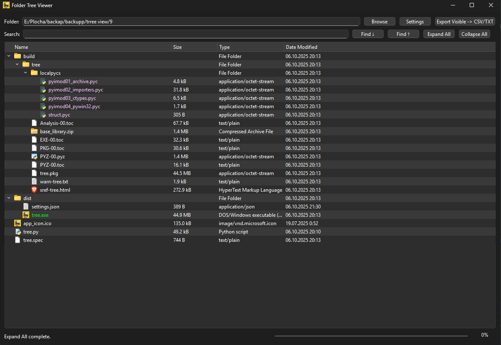

# 📂 Folder Tree Viewer

Here’s an app I coded — it shows all files in a selected folder in a clean **tree format**.  
Originally, I made it while working on my *SnowRunner Save Editor* to help visualize file structures.  
I ended up not using it, but since it might be useful to someone else, here it is.  

---

## 🧩 Features

- 📁 **Tree View of Files and Folders**  
- 🌈 **Extension-Based Color Highlighting**  
- 🔍 **Search Function**  
- 📦 **Folder Size Calculation**  
- 📊 **Expand / Collapse All**  
- ⚡ **Precount Mode**  
- 📂 **Multi-Selection and Copy Support**  
- 🖌️ **Custom Highlight Colors**  
- 💾 **Persistent Settings**  
- 🧠 **Threaded Operations**  
- 🔒 **Crash Protection & Error Handling**

---

## 🧰 How to Use

1. **Download the latest .exe in the assets**  
   👉 [Download](https://github.com/MrBoxik/Folder-Tree-Viewer/releases/tag/1.0)

2. **Run the app:**  
   Just open the `.exe` file — no install needed.

3. **Browse a folder or drive:**  
   Click *Browse*, and select a folder.

4. **Explore, search, and visualize your files.**

---

## 📸 Application Preview

---

## 💬 Feedback or Questions?

You can leave feedback [here on GitHub](https://github.com/MrBoxik/SnowRunner-Save-Editor/issues) — but I’m not going to be super active here.  

You’ll have better chances of getting a reply if you message me on [Discord](https://discord.com/users/638802769393745950).

---

## ☕ Support

If this save editor helped you and you want to say thanks, you can [buy me a coffee](https://buymeacoffee.com/mrboxik).  
Totally optional, just appreciated. ❤️

---

## 📜 License

This project is licensed under a **Custom Non-Commercial License**.  

You are free to use, modify, and share the code for personal and non-commercial purposes, with attribution.  
**Commercial use is not allowed** without prior written permission from the author.  

See the [LICENSE](LICENSE) file for full details.  
